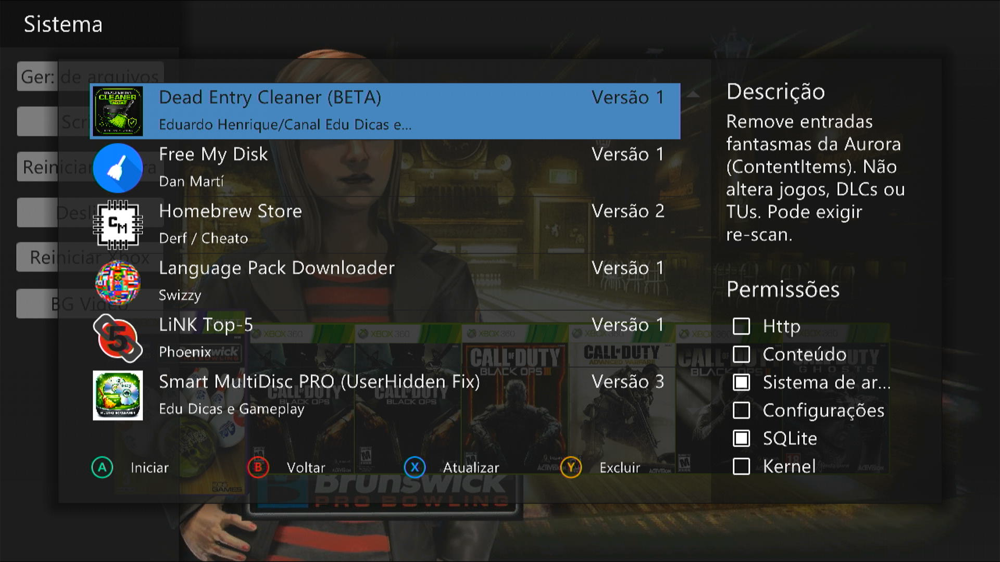
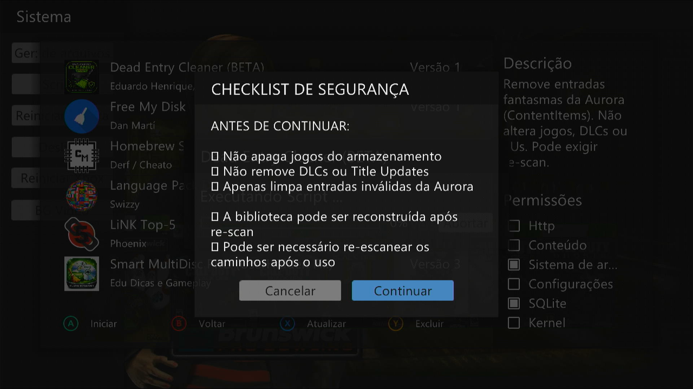
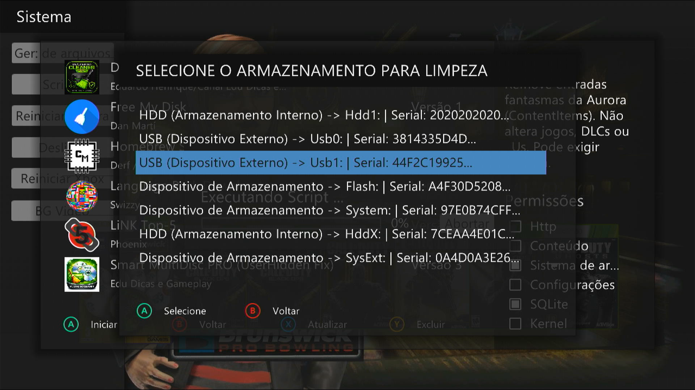
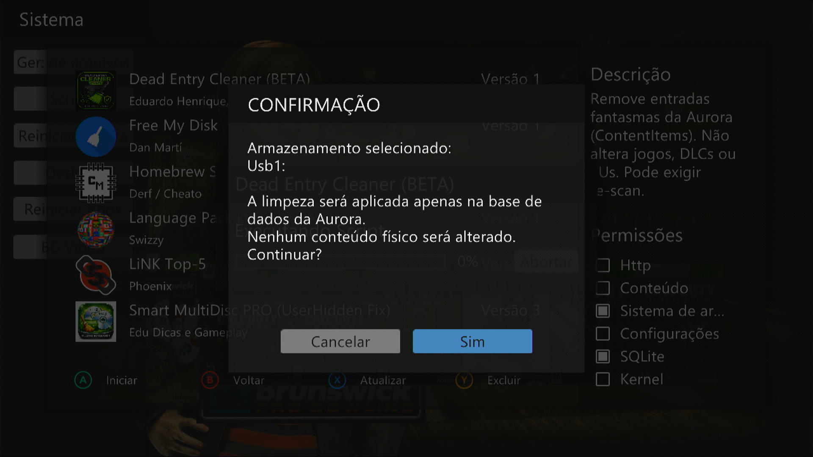
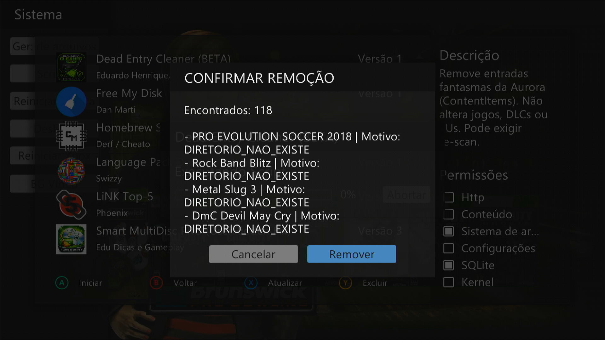
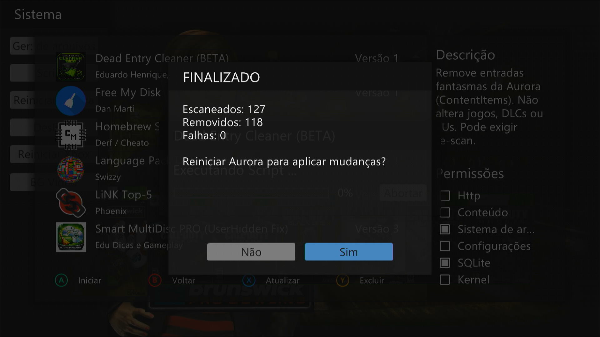

# 🧹 Dead Entry Cleaner (BETA)

Ferramenta inteligente para remover entradas fantasmas da Aurora sem afetar seus jogos ou conteúdos reais.

---

## 📌 Sobre

O **Dead Entry Cleaner** foi desenvolvido para limpar automaticamente o banco de dados da Aurora, removendo entradas inválidas que causam problemas como:

* Jogos que aparecem mas não abrem
* Itens duplicados ou “fantasmas”
* Biblioteca desorganizada ou bugada

A ferramenta atua diretamente no banco de dados (**ContentItems**), removendo apenas registros inválidos com base em múltiplas validações de segurança.

---

## 🖼️ Preview

### Seleção do script

<p align="center">
  
</p>

### Aviso de segurança (checklist)

<p align="center">
  
</p>

### Seleção de armazenamento

<p align="center">
  
</p>

### Confirmação do dispositivo

<p align="center">
  
</p>

### Confirmação de remoção

<p align="center">
  
</p>

### Resultado final (resumo)

<p align="center">
  
</p>

---

## 🧠 Principais Funcionalidades

* 🧹 Remoção de **entradas fantasmas (ContentItems inválidos)**
* 🔍 Detecção inteligente baseada em:

  * Diretório inexistente
  * Executável ausente (.xex)
  * Conteúdo GOD inválido
  * Diretórios vazios
* 🛡️ Sistema avançado de **proteção contra remoção acidental**
* 👁️ Pré-visualização dos itens antes da remoção
* 📊 Relatório final com:

  * Itens analisados
  * Removidos
  * Falhas

---

## 🛡️ Segurança

* ✔️ Não remove arquivos físicos do HD
* ✔️ Não apaga jogos, DLCs ou Title Updates
* ✔️ Protege automaticamente:

  * Aurora
  * XexMenu
  * DashLaunch
  * Emuladores
  * Homebrews
  * Plugins e serviços
* ✔️ Tratamento de erro com `pcall`
* ✔️ Confirmação obrigatória antes da remoção

> ⚠️ **Importante:**
> O script remove apenas registros do banco de dados, não arquivos reais.

---

## 📦 Quando usar

Utilize este script quando:

* 🎮 Jogos aparecem mas não abrem
* 👻 Existem entradas fantasmas na biblioteca
* 🔁 Você moveu ou deletou jogos manualmente
* 🧱 A biblioteca da Aurora está bugada
* 📂 Existem itens duplicados ou inválidos

---

## 📂 Backup (Recomendado)

Antes de executar, faça backup do arquivo:

```
Data\Databases\content.db
```

ou

```
User\Data\Databases\content.db
```

---

## ⚙️ Como funciona

1. Você confirma o checklist de segurança
2. Seleciona o dispositivo (limitação da Aurora)
3. O script analisa todo o banco de dados
4. Detecta entradas inválidas com base em múltiplas verificações
5. Exibe uma prévia dos itens encontrados
6. Remove apenas os itens confirmados
7. Exibe um resumo final

---

## 🔄 Recomendação

Após a execução:

* 🔁 Reinicie a Aurora (o script já oferece essa opção)
* ⚙️ Mantenha o **scan automático ativado** para reconstruir a biblioteca corretamente

---

## ⚠️ Limitações

* Não remove conteúdos parcialmente válidos (prioriza segurança)
* Pode ignorar entradas protegidas mesmo se estiverem quebradas
* Dependente do sistema de scan da Aurora para reconstrução da biblioteca

---

## 💡 Observações

* Rodar o script novamente pode encontrar novos itens se o scan automático recriar entradas
* O processo é seguro, mas não agressivo — evita remover qualquer coisa suspeita
* A seleção de drive existe por limitação da Aurora, mas a limpeza é aplicada ao banco como um todo

---

## ⚠️ Aviso

Use esta ferramenta apenas quando necessário.

Alterações diretas no banco de dados podem causar inconsistências se utilizadas fora do cenário adequado.

---

## 📌 Status

🟡 BETA — Em testes, mas já funcional e seguro para uso

---

## 💬 Contribuição

Sugestões, melhorias e feedback são bem-vindos!
